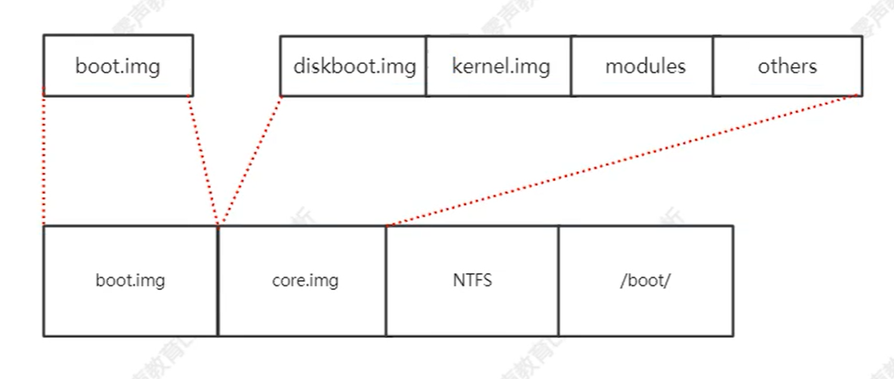

## Linux内核启动流程

#### 一、从电源启动到BIOS

- ##### 实时模式：

  在此模式地址访问为真实的内存地址，软件可以不受限制的操作所有地址的空间和IO设备。

- ##### 保护模式：

  全部内存使用虚拟内存、页等等机制对内存进行保护，相比实时模式更为安全可靠，也增加了扩展性和灵活性。

- ##### 从电源启动到BIOS：

  按下电源-->主板向电源组发出信号-->接收电源组信号-->启动CPU(重置所有寄存器，初始化数据)。

#### 二、从BIOS到BootLoader

- BIOS执行程序存储在ROM中，起始位置为0xFFFF0，当CS:IP 指向此位置时，BIOS开始执行。
- BIOS 程序会选择一个启动设备，并将控制权转交给启动扇区的代码，主要工作即:使用中断向量和中断服务程序完成BootLoader 的加载,最终将 boot.img 加载到 0x7c00 的位置启动。Linux 内核通过Boot protocol定义如何实现此引导程序。

#### 三、BootLoader工作加载流程

- boot.img由 boot.S 编译而成，512 字节，安装在启动盘的第一个扇区，即MBR。由于空间大小有限，所以代码简单，只是做为一个引导的作用。
- 加载 core 之后启动 main()-->初始化控制台，计算模块基地址，设置 root 设备，读取 grub 配置文件，加载模块。

#### 四、总结

按下电源开关加载完毕 BootLoader 整个过程，后面从实时模式进入保护模式，从而启动内核创建 0 号、1 号、2 号进程的整个过程。