## 智能控制原理

### 一、绪论

#### 1、智能控制概念

**智能控制(IC)**即设计一个**控制器或系统**使之具有**学习、抽象、推理、决策等功能**，并能根据环境信息变化做出适应性反应，从而实现由人来完成的任务。

#### 三元控制理论

##### 三元：

- AC：自动控制
- AI：人工智能
- OR：运筹学

##### 三元交集理论：

$$
IC=AC\cap AI\cap OR
$$

#### 2、分级递阶智能控制

三元交集除“智能”与控制外，还强调了在更高层次控制中调度、规划、管理和优化的作用，为**递阶智能控制**提供了理论依据。

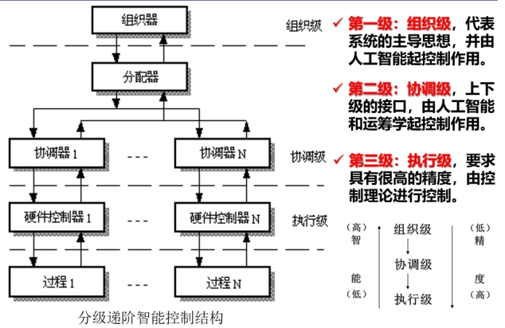

#### 3、控制科学的发展经历了哪些阶段

$$
[开环控制]\longrightarrow [确定性反馈控制]\longrightarrow[最优控制]\longrightarrow [随机控制]\longrightarrow [自适应控制][鲁棒控制]\longrightarrow[自学习控制]\longrightarrow[智能控制]
$$

#### 4、智能控制的特点

- 学习功能
- 适应功能
- 自组织功能
- 优化能力

### 二、专家系统与专家控制

#### 1、专家系统的主要构成、结构

##### （1）主要构成

- ##### 知识库

  1. 规则库
  2. 数据库

- ##### 推理机

  1. 解释程序
  2. 调度程序

##### （2）结构

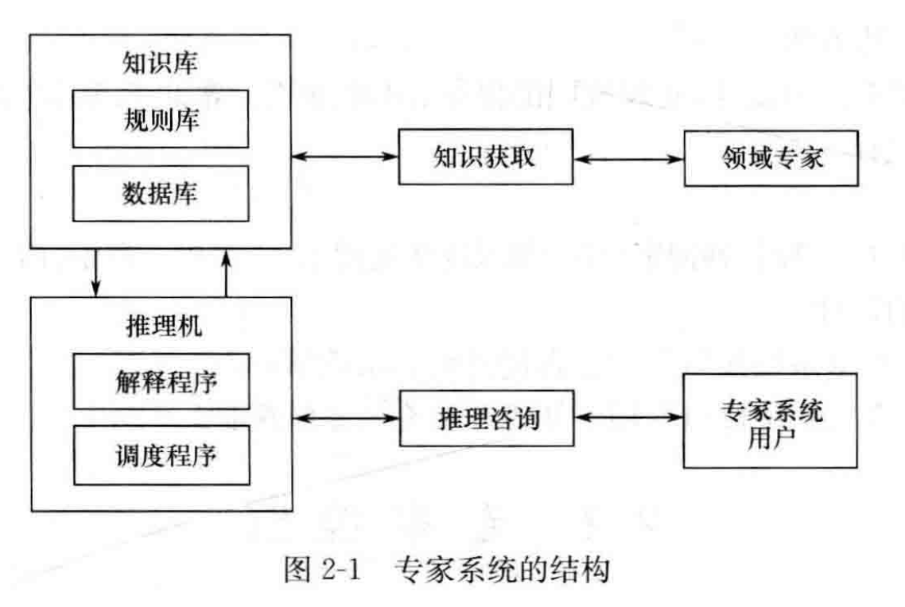

#### 2、专家控制的知识表示

##### （1）知识库

- 受控过程的知识
- 控制、辨识、诊断知识

##### （2）数据库

- 事实
- 证据
- 假设
- 目标

##### （3）规则库

​	产生式规则表示：
$$
if ~~控制局势（事实和数据）~then ~~操作结论
$$

#### 3、直接型专家控制器和间接型专家控制器各自在控制系统中的作用和功能

##### （1）直接型专家控制器

- ###### 作用

​	用于取代常规控制器，直接控制生产过程或被控对象。

- ###### 功能

​	具有模拟（或延伸、扩展）操作工人智能的功能。

##### （2）间接型专家控制器

- ###### 作用

​	用于和常规控制器相结合，组成对生产过程或被控对象进行间接控制的智能控制系统。

- ###### 功能

​	具有模拟（或延伸、扩展）控制工程师智能的功能。	

### 三、模糊控制的理论基础

#### 1、模糊集合的概念和表示

##### （1）概念

- ###### 隶属函数

  $$
  \mu_A(x)=\left\{ \begin{align}
  & 1     &x\in A \\
  & (0,1) &x\in A的程度 \\
  & 0     &x\notin A
  \end{align}
  \right.
  $$

- ###### 模糊集合

  ​	上式中 $A$ 为模糊集合

##### （2）表示

- ###### 如果论域 $U$是离散的

  1. 扎德（$Zadeh$）表示法:
     $$
     A = \left .\mu_A(x_1)\over x_1\right.+\left .\mu_A(x_2)\over x_2\right.+\cdots+\left .\mu_A(x_n)\over x_n\right. = \sum\limits_{i=1}^n\left .\mu_A(x_i)\over x_i\right.
     $$

  2. 序偶表示法：
     $$
     A = \{ (x_1~,~\mu_A(x_1))~,~(x_2~,~\mu_A(x_2))~,\cdots,~(x_n~,~\mu_A(x_n))\}
     $$

  3. 向量表示法：
     $$
     A=(\mu_A(x_1)~,~\mu_A(x_2)~,\cdots,\mu_A(x_n)~)
     $$

- ###### 如果论域 $U$是连续的

  $$
  A = \int _U \left.\mu_A(x)\over x\right.
  $$

#### 2、模糊集合的运算

##### （1）交运算

​	若 $C$ 为 $A$ 和 $B$ 的交集，则
$$
C=A\cap B
$$
​	一般地，有
$$
A\cap B\Leftrightarrow \mu_{A\cap B}(u)=\min (\mu_A(u)~,~\mu_B(u))=\mu_A(u)~∧~\mu_B(u)
$$

##### （2）并运算

​	若 $C$ 为 $A$ 和 $B$ 的并集，则
$$
C=A\cup B
$$
​	一般地，有
$$
A\cap B\Leftrightarrow \mu_{A\cup B}(u)=\max (\mu_A(u)~,~\mu_B(u)) =\mu_A(u)~∨~\mu_B(u)
$$

##### （3）补运算

​	若 $\overline A$为$A$的补集，一般地，有
$$
\overline A\Leftrightarrow \mu_{Λ}(u)=1-\mu_A(u)
$$

#### 3、典型隶属度函数

##### （1）$S$ 型隶属函数

$$
f(x,a,c)=\frac 1{1+e^{-a(x-c)}}
$$

​	其中，$a$ 的正、负决定了函数开口向左或向右，表示“正大”或“负大”的概念。$c$ 用于确定曲线的中心。

#####    （2）梯形隶属函数

$$
f(x,a,b,c,d)=\left\{\begin{align}
& 0 & x\leqslant a \\
& \frac {x-a}{b-a} & a\leqslant x\leqslant b \\
& 1 & b\leqslant x\leqslant c \\
& \frac {d-x}{d-c} & c\leqslant x\leqslant d \\
& 0 & x\geqslant d \\
\end{align}
\right.
$$

​	其中，$a$ 和 $d$ 确定梯形的“脚”，$b$ 和 $c$ 确定梯形的“肩膀”。

##### （3）三角形隶属函数

$$
f(x,a,b,c)=\left\{\begin{align}
& 0 & x\leqslant a \\
& \frac {x-a}{b-a} & a\leqslant x\leqslant b \\
& \frac {c-x}{c-b} & b\leqslant x\leqslant c \\
& 0 & x\geqslant c \\
\end{align}
\right.
$$

​	其中，$a$ 和 $c$ 确定三角形的“脚”，$b$ 确定三角形的“峰”。

##### （4）高斯型隶属函数

$$
f(x,\delta ,c) = e^{-{(a-c)^2 \over 2{\delta ^2}}}
$$

​	其中，$\delta$ 通常为正，$c$ 用于确定曲线的中心。

##### （5）广义钟形隶属函数

$$
f(x,a,b,c)=\frac 1 {1+|{\frac {x-c} a}|^{2b}}
$$

​	其中，$a$ 和 $b$ 通常为正，$c$ 用于确定曲线的中心。

#### 4、隶属函数的确定方法

##### （1）模糊统计法

​	利用确定性的实验来研究不确定的模糊现象，其基本思想是利用足够多的随机试验，对于要确定的模糊概念 $A$ 在讨论的论域中逐一写出定量范围，再进行统计处理，以确定能被大多数人认可的隶属度函数。确定隶属度函数的步骤为：

1. 选取一个论域 $U$;

2. 选择一个固定的元素 $ u\in U$;

3. 统计实验：由 $N$ 个不同的人将模糊集确定化为一个近似的经典集合；

4. 统计计算：随着 $N$ 的增加，下面的近似统计数会趋向于 $[0,1]$  闭区间上的一个固定值
   $$
   u属于模糊集合A的隶属度 = \frac {u\in A的次数}{试验总次数N}
   $$

##### （2）主观经验法

​	当论域为离散论域时，可根据主观认识，结合个人经验，经过分析和推理，直接给出隶属度。

##### （5）神经网络法

​	利用神经网络的学习功能，由神经网络自动生成隶属函数，并通过网络的学习自动调整隶属函数的值。

### 四、模糊控制

#### 1、模糊控制器的组成及各部分的功能

##### （1）模糊控制器的组成

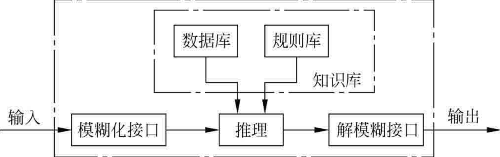

##### （2）各部分功能

- ###### 模糊化接口

   模糊控制器的输入必须通过模糊化才能用于控制输出的求解，因此它实际上是模糊控制器的输入接口。它的主要作用是将真实的确定量输入转换为一个模糊矢量。对于一个模糊输入变量 $e$，其模糊子集通常可以做如下方式划分：

   （1）$e= \{负大,负小,零,正小,正大\}=\{NB,NS,ZO,PS,PB\}$。

   （2）$e = \{负大,负中,负小,零,正小,正中,正大\}=\{NB,NM,NS,ZO,PS,PM,PB\}$。

   （3）$e= \{大,负中,负小,零负,零正,正小,正中,正大\}=\{NB,NM,NS,NZ,PZ,PS,PM,PB\}$。

- ###### 知识库

   - 数据库

   ​	存放所有输入、输出变量的全部模糊子集的隶属度矢量值，若论域为连续域则为隶属度函数。在规则推理的模糊关系方程求解过程中，向推理机提供数据。

   - 规则库

   ​	用来存放全部模糊控制规则，在推理时为“推理机”提供控制规则。

- ###### 推理机

   ​	根据输入模糊量，由模糊控制规则完成模糊推理来求解模糊关系方程，并获得模糊控制量。

- ###### 解模糊接口

   ​	将推理机的结果做转换，以求得清晰的控制量输出。

#### 2、模糊控制器的结构 

##### （1）单变量模糊控制器

- ###### 一维模糊控制器

   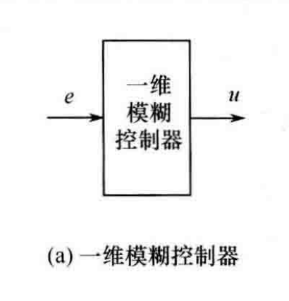

   ​	一维模糊控制器的输入变量往往选择为受控变量和输入给定值的偏差 $e$。由于仅仅采用偏差值，很难反映过程的动态特性品质，因此，所能获得的系统动态性能是不能令人满意的。

   ​	这种一维模糊控制器往往被用于一阶被控对象。

- ###### 二维模糊控制器

   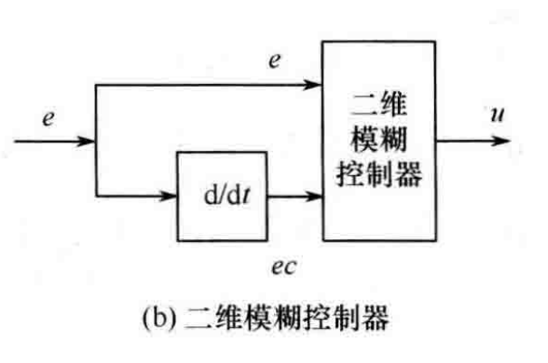

   ​	二维模糊控制器的两个输入变量基本上都选用受控变量值和输人给定值的偏差 $e$ 和偏差变化 $ec$ ，由于它们能够较严格地反映受控过程中输出量的动态特性，因此，在控制效果上要比一维控制器好得多，也是目前采用较广泛的一类模糊控制器。

- ###### 三维模糊控制器

   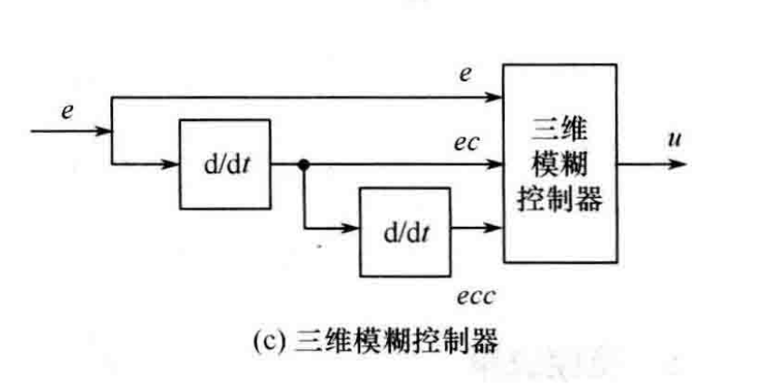

   ​	三维模糊控制器的3个输入变量分别为系统偏差量 $e$ 偏差变化量 $ec$ 和偏差变化的变化率 $ecc$。由于这种模糊控制器结构较复杂，推理运算时间长，因此，除对动态特性的要求特别高的场合之外，一般较少选用三维模糊控制器。

##### （2）多变量模糊控制器

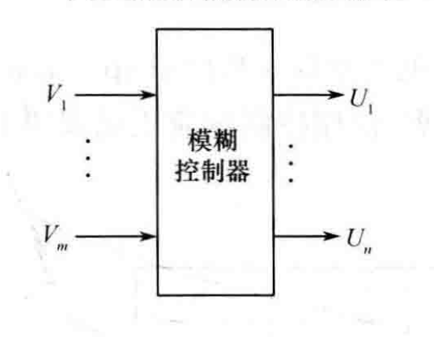

​	要直接设计一个多变量模糊控制器是相当困难的，可利用模糊控制器本身的解耦特点，通过模糊关系方程求解，在控制器结构上实现解耦即将一个多输入、多输出的模糊控制器分解成若干个多输入、单输出的模糊控制器这样可采用单变量模糊控制方法进行设计。

#### 3、反模糊化的方法

##### （1）最大隶属度法

​	选取推理结果的模糊集合中隶属度最大的元素作为输出值，即
$$
v_0=\max\mu_v(v),v\in V
$$
​	如果在输出论域 $V$ 中，其最大隶属度对应的输出值多于一个，则取所有具有最大隶属度输出的平均值，即
$$
v_0=\frac 1N \sum_{i=1}^n v_i~,~vi=\max_{v\in V} (\mu_v (v))
$$
​	其中，$N$ 为具有相同隶属度输出的总数。

​	最大隶属度法不考虑输出隶属度函数的形状，只考虑最大隶属度处的输出值。因此，难免会丢失许多信息。其突出优点是计算简单。在一些控制要求不高的场合，可采用最大隶属度法。

##### （2）重心法

​	重心法是取隶属度函数曲线与横坐标围成面积的重心作为模糊推理的最终输出值，即
$$
v_0={{\int_V v\mu_v(v){\rm d}v}\over {\int_V \mu_v(v){\rm d}v}}
$$
​	对于具有m个输出量化级数的离散域情况有 
$$
v_0={{\sum\limits_{k=1}^m v_k\mu_v(v_k)}\over {\sum\limits_{k=1}^m \mu_v(v_k)}}
$$
​	与最大隶属度法相比较,重心法具有更平滑的输出推理控制。即使对应于输入信号的微小变化，输出也会发生变化。

##### （3）加权平均法

$$
v_0={{\sum\limits_{i=1}^m v_ik_i}\over {\sum\limits_{i=1}^mk_i}}
$$

​	式中，$k_i $ 的选择根据实际情况而定。不同的系数决定系统具有不同的响应特性。

#### 4、**$Matlab$**中新建一个模糊推理系统的函数是什么

**$\rm{newfis('fishname')}$** 创建一个模糊推理系统（FIS）

### 五、神经网络的理论基础

#### 1、生物神经元的结构

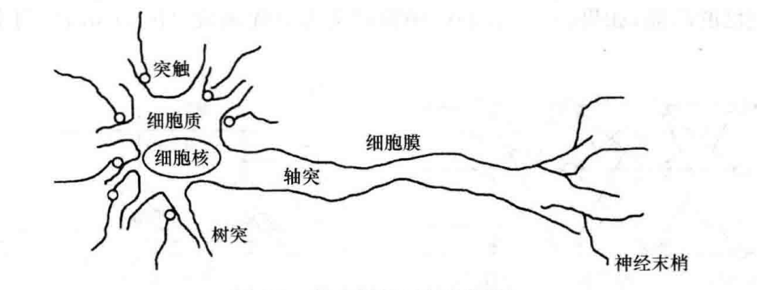

（1）**细胞体（主体部分）：**包括细胞质、细胞膜和细胞核;

（2）**树突：**用于为细胞体传入信息；
（3）**轴突：**为细胞体传出信息，其末端是神经末梢，含传递信息的化学物质；
（4）**突触：**是神经元之间的接。一个神经元通过其轴突的神经末梢，经突触与另外一个神经元的树突连接，以实现信息的传递。

#### 2、神经网络的学习算法

​	神经网络学习算法是神经网络智能特性的重要标志，神经网络通过学习算法，实现了自适应、自组织和自学习的能力。
​	目前神经网络的学习算法有多种，按有无导师分类,可分为有导师学习、无导师学习和再励学习等几大类。

​	在有导师的学习方式中，网络的输出和期望的输出(即导师信号)进行比较，然后根据两者之间的差异调整网络的权值，最终使差异变小。

​	在无导师的学习方式中,输入模式进入网络后，网络按照一种预先设定的规则(如竞争规则)自动调整权值，使网络最终具有模式分类等功能。

​	再励学习是介于上述两者之间的一种学习方式。

#### 3、**$\rm{Hebb}$**学习规则和 **$\rm\delta$** 学习规则的基本思想

##### （1）**$\rm{Hebb}$**学习规则

​	**$\rm{Hebb}$**学习规则是一种联想式学习算法。基于对生物学和心理学的研究，认为两个神经元同时处于激发状态时，它们之间的连接强度将得到加强，这一论述的数
学描述被称为 **$\rm{Hebb}$**学习规则，这种方法又称为相关学习或并联学习。

##### （2）**$\rm\delta$** 学习规则

​	神经网络学习的目的是通过调整权值 $\rm W$ ，使误差准则函数最小。可采用梯度下降法来实现权值的调整，其基本思想是沿着 $\rm E$ 的负梯度方向不断修正 $\rm W$ 值，直到 $\rm E$ 达到最小，这种方法称为 **$\rm\delta$** 学习规则，又称误差修正规则。

### 六、典型神经网络

#### 1、单神经元的结构，数学模型，常用神经元非线性特性

##### （1）结构

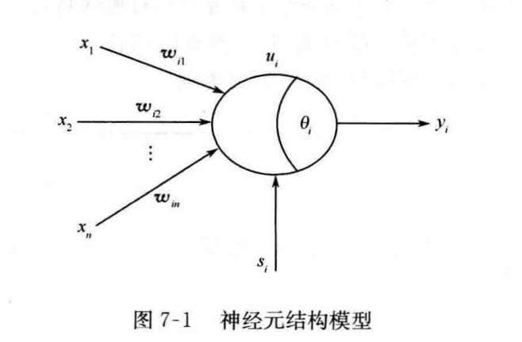

##### （2）数学模型

$$
net_i=\sum_j w_{ij}x_j+s_j-\theta_i
$$
$$
u_i=f(net_i)
$$
$$
y_i=g(u_i)=h(net_i)
$$

​	通常情况下，取 $g(u_i)=u_i$，即 $y_i=f(net_i)$。

##### （3）常用神经元非线性特性

- ###### 阈值型

- ###### 分段线性型

- ###### 函数型

#### 2、BP神经网络的特点和结构

##### （1）特点：

- BP网络是一种多层网络，包括输入层、隐层和输出层；
- 层与层之间采用全互连方式，同一层神经元之间不连接；
- 权值通过 $\delta$ 学习算法进行调节；
- 神经元激发函数为 $S$ 函数；
- 学习算法由正向传播和反向传播组成；
- 层与层的连接是单向的，信息的传播是双向的。

##### （2）结构：

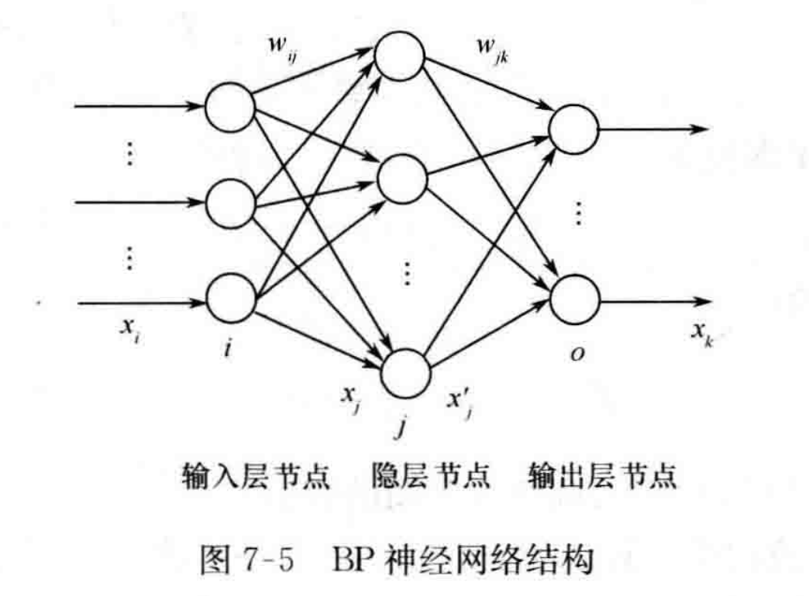

​	含一个隐层的BP网络结构，图中，$i$ 为输入层，$j$ 为隐层，$o$ 为输出层。

#### 3、BP 网络的前向信息传播过程

（1）隐层神经元的输人为所有输入的加权之和，即
$$
x_j=\sum_iw_{ij}x_i
$$
（2）隐层神经元的输出 $x'_j$ 采用 $S$ 函数激发 $x_j$ 得
$$
x'_j=f(x_j)=\frac 1{1+e^{-x_j}}
$$
​	则
$$
{{\partial{x'_j}}\over{\partial{x_j}}}=x'_j(1-x'_j)
$$
（3）输出层神经元的输出为
$$
y_n(k)=\sum_jw_{jo}x'_j
$$

- 网络输出与理想输出误差为

$$
e(k)=y(k)-y_n(k)
$$

- 误差性能指标函数为

$$
E=\frac12e(k)^2
$$

#### 4、高斯型径向基函数的参数（宽度 $b_j$ 和中心点 $c_j$ ）对  RBF 网络的影响

（1）$b_j$ 越宽，网路对输入的映射能力越大,否则，网路对输入的映射能力越小。一般将 $b_j$ 值设计为适中的值。

（2）$c_j$ 值离输入越近，高斯函数对输入越敏感，否则，高斯函数对输入越不敏感；

（3）中心点坐标向量 $c_j$ 应使高斯基函数在有效的输人映射范围内。

### 七、神经网络控制

#### 1、神经网络直接逆控制

​	神经网络直接逆控制就是将被控对象的神经网络逆模型直接与被控对象串联起来，以便使期望输出与对象实际输出之间的传递函数为 1。则将此网络作为前馈控制器后，被控对象的输出为期望输出。

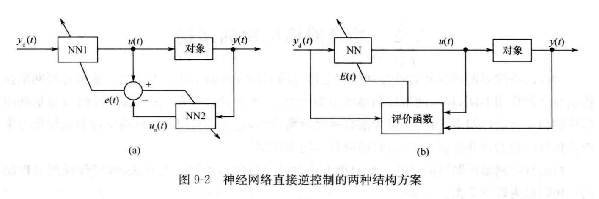

#### 2、神经网络自校正控制

​	神经网络自校正控制分为直接自校正控制和间接自校正控制。间接自校正控制使用常规控制器，神经网络估计器需要较高的建模精度。直接自校正控制同时使用神经网络控制器和神经网络估计器。

##### （1）神经网络直接自校正控制

​	在本质上同神经网络直接逆控制。

##### （2）神经网络间接自校正控制

​	假设被控对象为如下单变量仿射非线性系统
$$
y(t)=f(y_t)+g(y_t)u(t)
$$

​	若利用神经网络对非线性函数 $f(y_t)$ 和 $g(y_t)$ 进行逼近得到 $\hat{f}(y_t)$ 和 $\hat{g}(y_t)$ 则常规控制器为
$$
u(t)={r(t)-\hat{f}(y_t)\over\hat{g}(y_t)}
$$
​	式中，$r(t)$ 为 $t$ 时刻的期望输出值。

### 八、智能算法

#### 1、遗传算法的基本操作、基本思想

##### （1）基本操作

- 复制
- 交叉
- 变异

##### （2）基本思想

​	遗传算法将“优胜劣汰，适者生存”的生物进化原理引入优化参数形成的编码串联群体中，按所选择的适配值函数并通过遗传中的复制、交叉及变异对个体进行筛选，使适配值高的个体被保留下来，组成新的群体，新的群体既继承了上一代的信息，又优于上一代。这样周而复始，群体中个体适应度不断提高，直到满足一定的条件。遗传算法的算法简单，可并行处理，并能得到全局最优解。

#### 2、遗传算法的特点

- 是对参数的编码进行操作，而非参数本身；
- 同时使用多个搜索点的搜索信息；
- 直接以目标函数作为搜索信息；
- 使用概率搜索技术；
- 在解空间进行高效启发式搜索；
- 对于待寻优的函数基本无限制；
- 具有并行计算的特点。

#### 3、遗传算法的构成要素

- 染色体编码方法；
- 个体适应度评价；
- 遗传算子；
- 基本遗传算法的运行参数。

